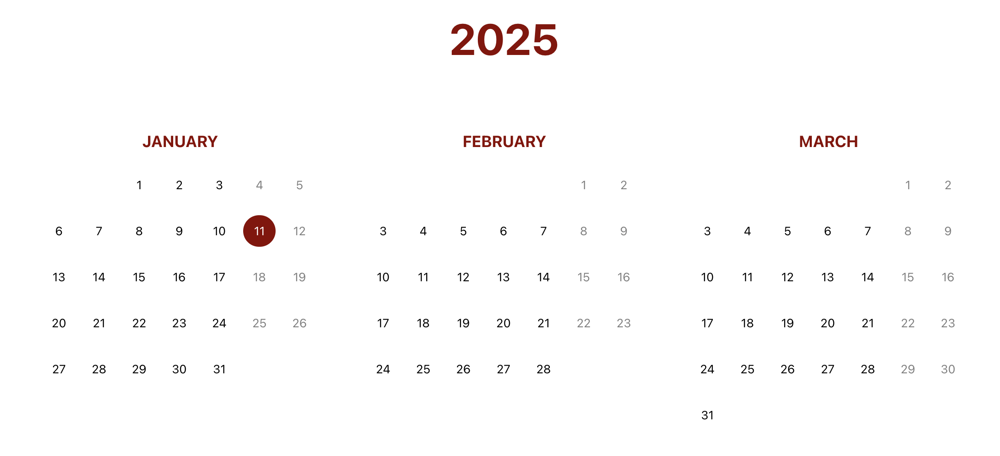
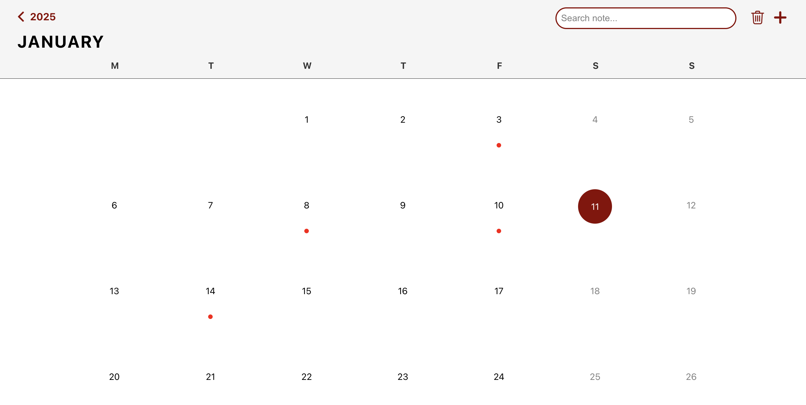
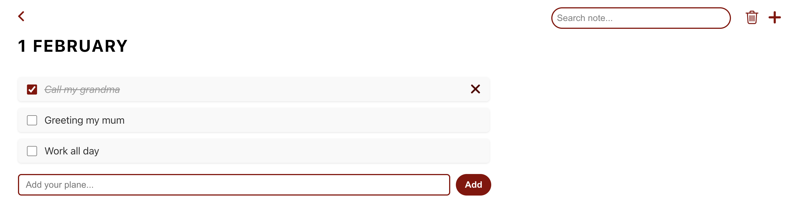

# Notes Calendar App

A web application for creating and managing notes tied to calendar days. You can add, view, complete, and delete notes, all in an intuitive monthly view.  
The app is built using **React** for the frontend, **Node.js** and **Express** for the backend, and **PostgreSQL** for the database, with **Docker** for containerized development.

## Screenshots





## You can run the Project with Docker

### Step 1
```bash
docker compose build
```
### Step 2
```bash
docker compose up
```

### Step 3
Open in browser: http://localhost:5173/year